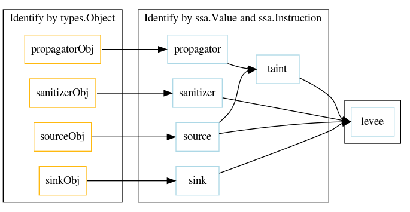

# Technical design of go-flow-levee

## Prerequisite Reading
The analysis tools contained in this repository rely heavily on the
 [golang.org/x/tools/go/analysis](https://pkg.go.dev/golang.org/x/tools/go/analysis),
 [golang.org/x/tools/go/ssa](https://pkg.go.dev/golang.org/x/tools/go/ssa),
 and [golang.org/pkg/go/types/](https://golang.org/pkg/go/types/) packages.
This document assumes the reader's high-level familiarity with them.

## High Level Concepts

### Analyzers and Analyzer Dependency

The `analysis` package enables analysis as a package-level granularity.

A single `analysis.Analyzer` may require the `Result` of another `Analyzer`.
For instance, much of the analysis performed here relies directly upon the Static Single Assignment
graph produced by the [`buildssa.Analyzer`](https://pkg.go.dev/golang.org/x/tools/go/analysis/passes/buildssa).
Such a dependency is expressed by the `Analyzer.Requires` field.
This creates a "horizontal" dependency between different analyzers within the same package.
("Vertical" dependencies between different packages within the same analyzer can also exist.
See the `analysis` documentation for details.)

In this way, `go-flow-levee` separates each classification of values and instructions into a separate `Analyzer`s.

### Value and Instruction Classification

The analysis tools in this repository performs a general *taint propagation analysis.*
This involves identification of source and taint values, and sink, propagator, and sanitizer instructions.

A *source* is a value to be tracked.
This may be PII that should not be logged or user input that should not reach an SQL call without sanitization.

A *sink* is an instruction that should not be called with a source as an argument.
This would result in improper logging of PII or expose SQL injection as an attack vector, depending on the source and sink in question. 

A *propagator* is an instruction which may extract source data or convert it to an unexpected type.
For instance, source data may be present in the string returned by a struct's `String()` method or the content in a a writer following `fmt.Fprintf(w, format, source)`.
These *tainted values* may also be unsafe to reach a sink.

A *sanitizer* is an instruction which allows a source to reach a sink.
A sanitizer might set fields which normally contain PII to be a zero-value, or validate a user string as containing no malicious input.

## Subordinate Analyzers

For our use, all sources, sinks, propagators, and sanitizers are associated to a [`types.Object`](https://godoc.org/go/types#Object).
For sources, this corresponds to the `types.Named` declaration.
For sinks, propagators, and sanitizers, this corresponds to the `types.Func`.
Each of these can be identified by a distinct analyzer.

At runtime, these named declarations are used as `ssa.Value` and `ssa.Instruction`.
Each source instantiation corresponds to a [`ssa.Value`](https://godoc.org/golang.org/x/tools/go/ssa#Value).
Each invocation of a sink, source, or sanitizer corresponds to a [`ssa.Instruction`](https://godoc.org/golang.org/x/tools/go/ssa#Instruction).
Each of these can be identified by a distinct analyzer.

An mock-up of analyzer dependency is given below.

